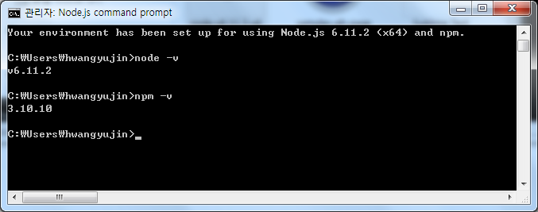

# hello-world
just test

 내 컴퓨터는 LG 노트북이고. Windows 7, 64bit 임.

 

# nodejs
 [Nodejs](http://nodejs.org) 에서 LTS 버전으로 download 할끼다.

 
 
 msi 파일을 받아서 설치했다.

 
 
 설치하면 시작메뉴에 나타났다.

 

 
 
 Nodejs command prompt 실행해서 버전확인해보면..

 
